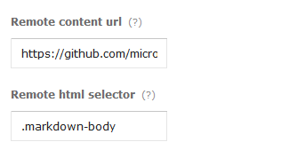

module-medium
=============

A Microweber module to sync content from external website

This module is useful if you have external source of content and want this synchronized with a page on your website

## How to install in Microweber

* Download this repo [from here](https://github.com/microweber/module-medium/archive/master.zip "")
* Upload to your Microweber site in new folder such as folder `userfiles/modules/medium`
* Go to "Modules" in the admin panel and click the "Reload modules" link

## How to use

* When you install it and go to "Add page" you must see this screen-shot under "Advanced settings"

